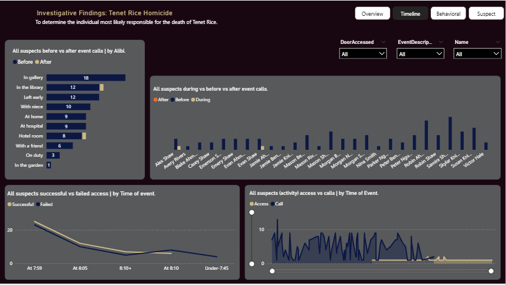
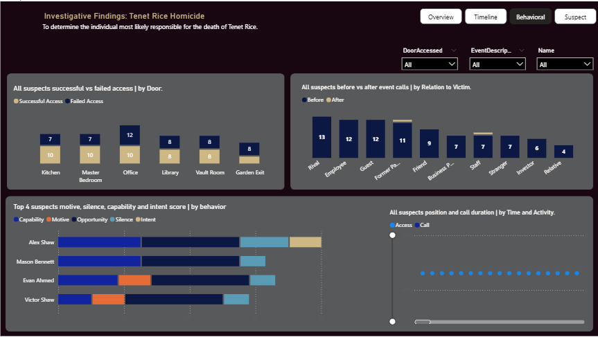
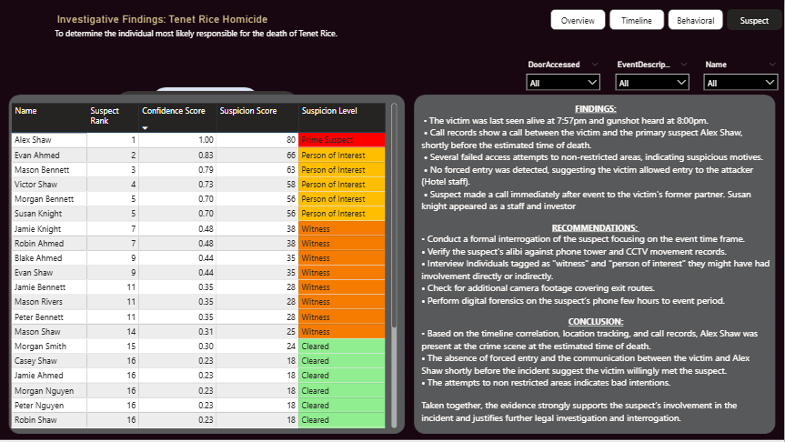

### INVESTIGATIVE FINDINGS — TENET RICE HOMICIDE

## *Table of Contents*

- [Objective](#Objective)
- [Methodology](#Methodology)
- [DataModeling](#Data-Modeling)
- [Processing](#Processing)
- [Dashboard](#Dahboard)
- [Findings](#Findings)
- [SuspectElimination](#SuspectElimination)
- [SRecommendations](#Recommendations)
- [Conclusion](#Conclusion)

**Objective**
To determine the individual most likely responsible for the death of Tenet Rice using behavioural, communication and access-control evidence recorded between the victim’s last confirmed sighting and the emergency call.

---

### Methodology

All suspects were evaluated using a weighted behavioural scoring model built on four forensic indicators:

1. **Opportunity** — physical presence and door access within the critical time window
2. **Capability** — failed or forced access attempts indicating restricted-area targeting
3. **Intent** — abnormal communication activity compared to personal baseline behaviour
4. **Concealment Behaviour** — sudden silence or activity drop after the event
5. **Motive Proxy** — relationship risk level to the victim

Each suspect received a quantified suspicion score based on deviations from their normal behaviour rather than overall activity totals.

---

## Data Modeling

### Dashboard

### Event Reconstruction

Between the victim’s last confirmed sighting and the emergency call, building activity narrowed significantly to a small subset of individuals.

During this period:

* Access attempts became concentrated rather than distributed
* Communication behaviour shifted from routine patterns to targeted bursts
* Multiple individuals ceased activity immediately after the event window

This pattern is inconsistent with routine workplace behaviour and consistent with a coordinated or intentional action period.

---

### Behavioural Findings

The scoring model identified three behavioural markers strongly associated with involvement:

• Presence at secured locations during the event
• Access attempts inconsistent with job role
• Abrupt behavioural silence following the incident

Most individuals displayed only one marker or none.
One individual displayed multiple markers simultaneously.

---

### Suspect Elimination

The majority of suspects were eliminated for the following reasons:

* No presence within the event window
* Behaviour consistent with normal baseline patterns
* No restricted-area interaction
* Continuous communication activity after the incident (indicating normal routine)

These individuals are statistically consistent with uninvolved actors or witnesses.

---

### Prime Suspect Determination

One subject demonstrated a unique convergence of indicators:

* Verified activity within the critical time window
* Repeated restricted-area access behaviour
* Communication pattern deviation from baseline
* Immediate behavioural silence after the incident
* Relationship category associated with elevated conflict probability

This combination of opportunity, capability, behavioural deviation and concealment behaviour produced the highest suspicion score among all subjects.

---

### Conclusion

Based on quantified behavioural evidence rather than aggregate activity volume, the analysis identifies the top-ranked individual as the **most probable perpetrator**.

The determination is supported by converging independent indicators rather than a single anomalous metric, reducing the likelihood of coincidence.

This report does not establish legal guilt, but establishes investigative priority with measurable analytical justification.

### FINDINGS:

 • The victim was last seen alive at 7:57pm and gunshot heard at 8:00pm.
 
 • Call records show a call between the victim and the primary suspect Alex Shaw, shortly before the estimated time of death.

 • Several failed access attempts to non-restricted areas, indicating suspicious motives.

 • No forced entry was detected, suggesting the victim allowed entry to the attacker (Hotel staff).

 • Suspect made a call immediately after event to the victim's former partner. Susan knight appeared as a staff and investor

### RECOMMENDATIONS: 

• Conduct a formal interrogation of the suspect focusing on the event time frame.

• Verify the suspect’s alibi against phone tower and CCTV movement records.

• Interview Individuals tagged as "witness" and "person of interest" they might have had involvement directly or indirectly.

• Check for additional camera footage covering exit routes.

• Perform digital forensics on the suspect’s phone few hours to event period.

### CONCLUSION:

• Based on the timeline correlation, location tracking, and call records, Alex Shaw was present at the crime scene at the estimated time of death.

• The absence of forced entry and the communication between the victim and Alex Shaw shortly before the incident suggest the victim willingly met the suspect.

• The attempts to non restricted areas indicates bad intentions. 

Taken together, the evidence strongly supports the suspect’s involvement in the incident and justifies further legal investigation and interrogation.
